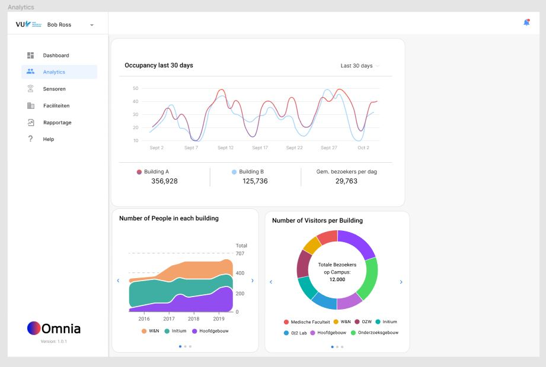

## Frontend Developer Assignment: Campus Occupancy Dashboard

### Objective:
Your task is to develop a one-page dashboard to analyze campus occupancy data. The dashboard will visualize occupancy trends and provide insights for building managers to understand utilization and occupancy of the buildings.

### Data Source and API:
You will utilize an API to retrieve occupancy data. The API provides endpoints to access building-level and room-level occupancy data. 

- **Building-level Data Endpoint**: This endpoint retrieves occupancy data for entire buildings on campus. The data includes information such as building ID, name, capacity, and hourly occupancy counts. Building-level data helps in understanding the overall occupancy trends across different buildings.

  Endpoint: [API Base URL]/building-level-data/{start_date}/{end_date}

- **Room-level Data Endpoint**: This endpoint retrieves occupancy data for individual rooms within buildings. The data includes information such as building ID, room ID, room name, capacity, and hourly occupancy counts. Room-level data provides detailed insights into occupancy patterns within specific rooms.

  Endpoint: [API Base URL]/room-level-data/{start_date}/{end_date}

You can find detailed documentation and interact with the API using Swagger UI:

Swagger UI: https://bwrrs9ey67.execute-api.eu-central-1.amazonaws.com/

### Requirements:

1. **Framework**: Use React Next.js for building the dashboard.

2. **Dashboard Visualization**:
   - Display occupancy trends over time in a clear and intuitive manner using charts.
   - Utilize Apex Charts or Echarts for data visualization.
   - Implement user-friendly UI elements for interaction and navigation.

3. **User Experience**:
   - Design the dashboard with building managers in mind, focusing on ease of use and clarity of information.
   - Provide filters or selectors to allow users to explore different time periods or specific buildings.
   - Ensure that the dashboard provides actionable insights for decision-making.

4. **Evaluation Criteria**:
   - Your ability to process data from the API and handle asynchronous operations.
   - Implementation of user-friendly UI and data visualizations.
   - Code quality, organization, and adherence to best practices in React development.
   - Creativity and attention to detail in dashboard design.

5. **Submission**:
   - Share your code via a link to your public repository (GitHub, GitLab, etc.).
   - Include any necessary instructions for running the project locally.
   - Deadline for submission is Friday, 17th of May.

### Additional Information:
- You are required to use React Next.js for building the dashboard.
- API endpoints and data format will be provided to you during the assignment.
- Focus on functionality and user experience over elaborate design.
- Feel free to ask any questions for clarification during the assignment.

### Resources:
- Next.js Documentation: [Next.js Docs](https://nextjs.org/docs/getting-started)
- Apex Charts Documentation: [ApexCharts Docs](https://apexcharts.com/docs/react-charts/)
- Echarts Documentation: [Echarts Docs](https://echarts.apache.org/en/index.html)

### Examples:
- In the image underneath you can see a first version of a dashboard page designed by Omnia.

- https://spacewell.com/resources/blog/occupancy-monitoring-data-driven-workplace-optimization/
- https://reelyactive.github.io/diy/kibana-occupancy-dashboard/
### Note:
This assignment is designed to assess your frontend development skills, including data processing, UI/UX design, and data visualization. Take your time to build a quality solution that showcases your abilities. If you have any questions about the data or API, don't hesitate to ask.